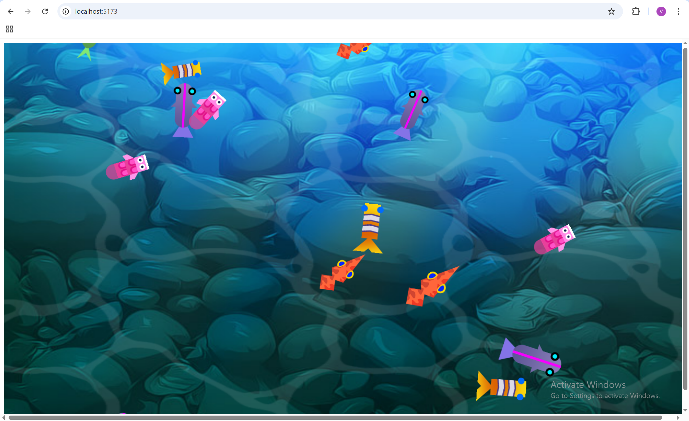
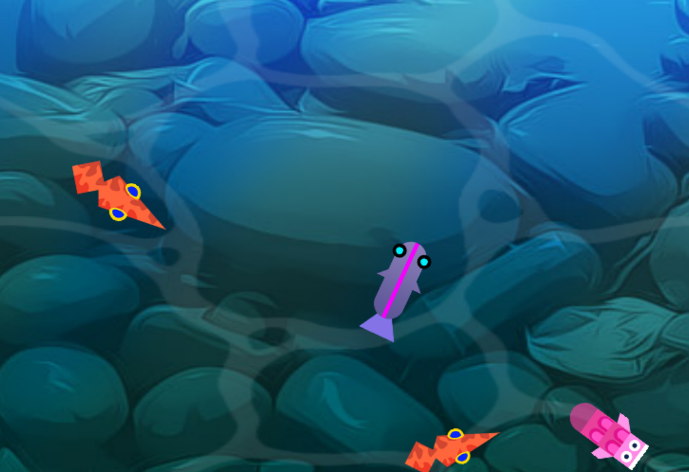
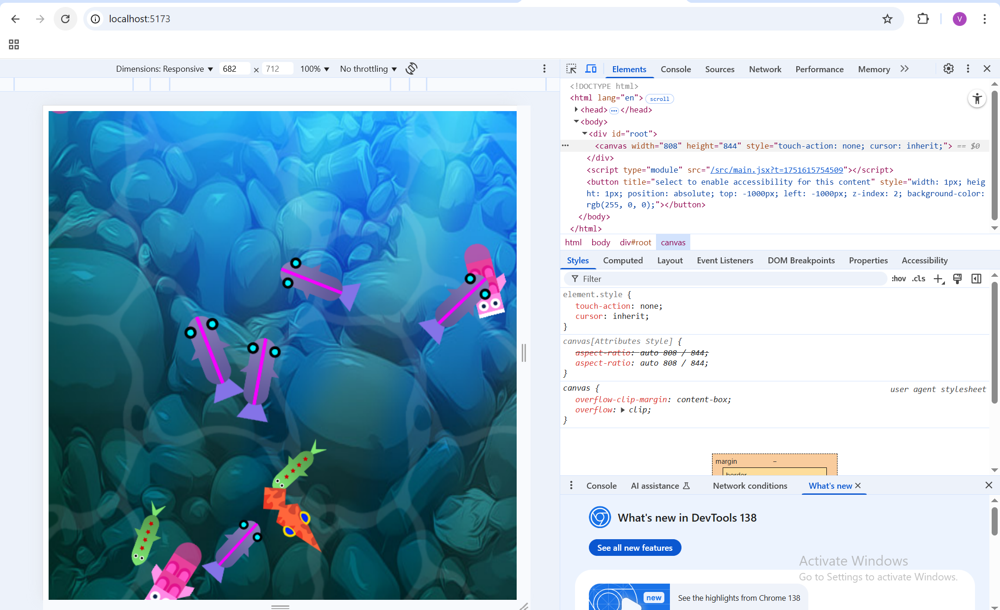

# 🐠 React Fish Pond – Pixi.js Integration

This project is a React-based implementation of the original Pixi.js Fish Pond tutorial. It demonstrates the use of `@pixi/react` to create dynamic, responsive canvas-based animations in a modular React environment.

---

## 🔗 GitHub Repository

[👉 View the Project on GitHub](https://github.com/vishwajeet-patil-dev/fish-pond-assignment)

---

## ⚙️ How to Run the Project

Follow the steps below to run this project locally:

### 1. Clone the Repository

```bash
git clone https://github.com/vishwajeet-patil-dev/fish-pond-assignment.git
```

### 2. Go To Project Folder

```bash
cd react-fish-pond
```

### 3. Install Dependancies

```bash
npm install
```

### 4. Run Project LOcally

```bash
npm run dev
```

### 5. Open In Your Browser

```bash
http://localhost:5173
```

## 🖼️ Screenshots

### 🏞️ Pond Overview



### 🐟 Animated Fish



### 📱 Responsive View


